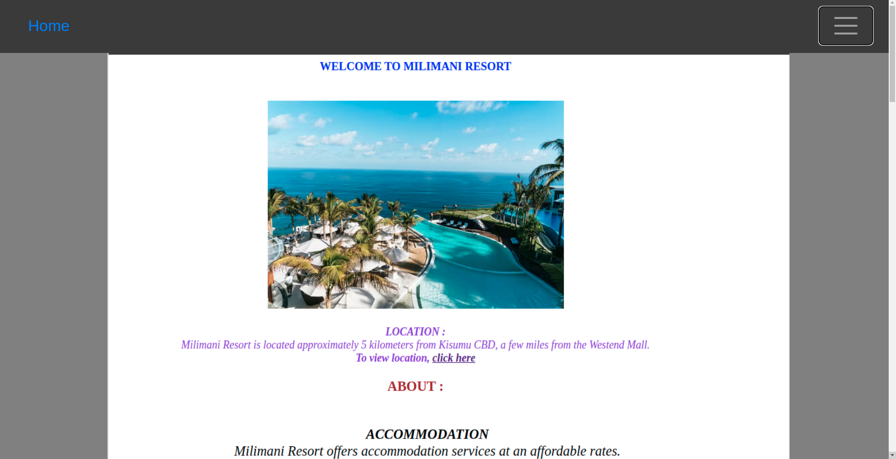
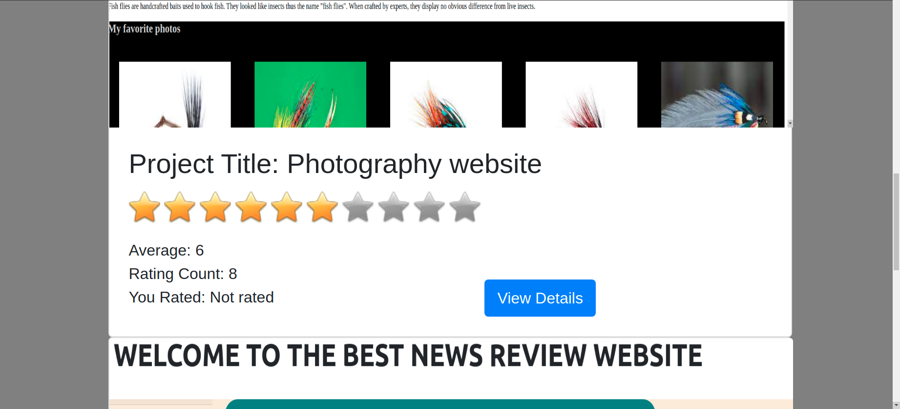

## Awards-App
## Build by :
Onyango Anipher Chelsea
## Description
This is an application like Awwards where users can signup, login and post a project to be reviewed and rated.

## Screenshot images

## Live page
https://github.com/chelseaayoo/Awards

## User stories
Users would like to:

View posted projects and their details
Post a project to be rated/reviewed
Rate/review other users' projects
Search for projects
View projects overall score
View my profile page

## Behaviour Driven Development (BDD)
Behaviour	Input	Output
Admin Authentication	On demand	Access Admin dashboard
Admin Authentication	On demand,Verify emails before proceeding	Access Admin dashboard
Display all projects	Home page	Clickable links to open live projects in different sites
To add a project	Through Admin dashboard and homepage	Click on add and upload respectively
To edit project	Through Admin dashboard	Redirected to the project form details and editing happens
To delete the project	Through Admin dashboard	click on project object and confirm by delete button
To search projects by title	Enter text in search bar	Users can search by project title
Comment on projects	Add comments below respectively project	Users can add comments on any project
Vote on projects	Vote	Users can review projects they like and comment

## Setup | Installation Requirements
python3.8
virtualenv
requirements.txt
django3.2.8

Cloning
Open Terminal {Ctrl+Alt+T}
$git clone https://github.com/chelseaayoo/Awards

$cd Awards
open based on the text editor you have.
Running the Application
Creating the virtual environment
pip install virtualenv 
virtualenv venv
$ source venv/bin/activate

Install Django Dependencies
pip install -r requirements.txt
Setup Database
setup your database User,Password, Host then make migrations
python manage.py makemigrations
Now migrate
$python manage.py migrate
To run the application, in your terminal:
$ python3.8 manage.py runserver

## Technologies used
django3.2.8 and postgresql
HTML5
CSS3
Bootsrap4
python3.8

## Known Bugs
 Currently there are no known bugs but if you find a bug, kindly feel free to comment an issue here and inlcude their corresponding results.

## Contact Information:
Feel free to contact me incase of any issues or questions, ideas and concern towards the same.

E-Mail: chelsea.ayoo@student.moringaschool.com

## License
MIT License Copyright (c) [2021] [ONYANGO ANIPHER CHELSEA AYOO]

Permission is hereby granted, free of charge, to any person obtaining a copy of this software and associated documentation files (the "Software"), to deal in the Software without restriction, including without limitation the rights to use, copy, modify, merge, publish, distribute, sublicense, and/or sell copies of the Software, and to permit persons to whom the Software is furnished to do so, subject to the following conditions:

The above copyright notice and this permission notice shall be included in all copies or substantial portions of the Software.

THE SOFTWARE IS PROVIDED "AS IS", WITHOUT WARRANTY OF ANY KIND, EXPRESS OR IMPLIED, INCLUDING BUT NOT LIMITED TO THE WARRANTIES OF MERCHANTABILITY, FITNESS FOR A PARTICULAR PURPOSE AND NONINFRINGEMENT. IN NO EVENT SHALL THE AUTHORS OR COPYRIGHT HOLDERS BE LIABLE FOR ANY CLAIM, DAMAGES OR OTHER LIABILITY, WHETHER IN AN ACTION OF CONTRACT, TORT OR OTHERWISE, ARISING FROM, OUT OF OR IN CONNECTION WITH THE SOFTWARE OR THE USE OR OTHER DEALINGS IN THE SOFTWARE. Copyright (c) {2021} {ONYANGO ANIPHER CHELSEA AYOO}

## Copyright
Copyright (c) {2021} ONYANGO ANIPHER CHELSEA
